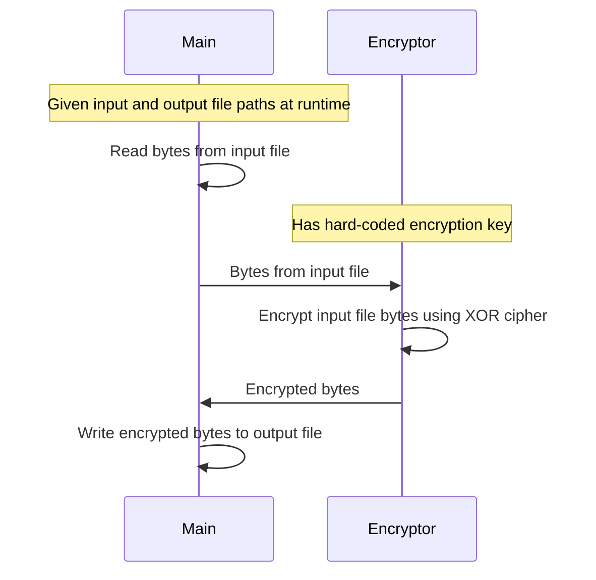

# Rust Programming Task: Implementing a Simple File Encryption Tool

This document describes the design of the File Encryption Tool, which takes an input file and encodes its contents to and output file. The encryption key will be a constant key used throughout each encryption. 

## Requirements
- Runs via command-line argument
    - Input file path
    - Output file path
- XOR cipher to encrypt the data bytes
- Unit tests to test the XOR cipher function

## Sequence Diagram

## Methods
***fn main() -> io::Result<()> {}***

    Main method which reads command-line arguments at runtime and uses the XOR cipher to encrypt the data

***fn XOR_Cipher(data: &[u8]) -> Vec<u8>{}***

    Computes the XOR Cipher algorithm on the data on a slice of bytes in memory

    Arguments:
        data (&[u8]): the memory address of the slice of an 8-bit unsigned integer referencing the input file bytes
    Returns:
        a vector of 8-bit unsigned integers containing encrypted bytes